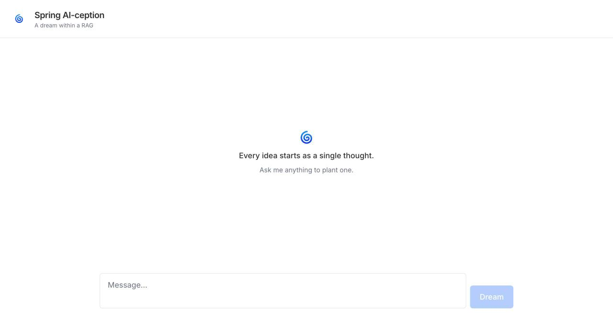

# 🌀 spring-ai-ception

A meta RAG & persistent chat memory service that uses Spring AI to answer questions about Spring AI.



## Project structure

- `api/` — Spring Boot backend (Java 21, Spring AI + Ollama + pgvector)
- `web/` — React + TypeScript frontend (Vite), streaming chat UI
- `scraping/` — Python scraper that builds `data/docs.jsonl` from the Spring AI docs
- `data/` — scraped documents ingested into the vector store
- `docker-compose.yaml` — orchestrates the `ollama`, `postgres`, `api`, and `web` services

## Running with Docker Compose (recommended)

Requires [Docker](https://docs.docker.com/get-docker/) with Compose.

```bash
docker compose up --build
```

This builds and starts four services:

- `ollama` — model runtime, pulls `qwen2.5:7b` (chat) and `nomic-embed-text` (embeddings) on first start
- `postgres` — pgvector-backed store for embeddings and chat memory, available at `localhost:5432`
- `api` — Spring Boot backend, available at http://localhost:8080
- `web` — frontend served by nginx at http://localhost:3000 (proxies `/api/` to the backend)

The first run can take a while while the Ollama models are downloaded. Once `ollama` and `postgres` report healthy, `api` and `web` start automatically.

### Ingesting the docs

The chat endpoint answers from whatever has been ingested into the vector store. If `data/docs.jsonl` already exists (checked into the repo), the API loads it automatically on request via the ingestion endpoint:

```bash
curl -X POST http://localhost:8080/admin/ingest
```

To scrape a fresh copy of the docs instead, run the `scraper` service (profile-gated so it doesn't run on every `up`):

```bash
docker compose --profile ingest run --rm scraper
```

## Running locally (without Docker)

### Prerequisites

- Java 21
- Node.js 20+
- [Ollama](https://ollama.com/) installed and running locally
- PostgreSQL with the [pgvector](https://github.com/pgvector/pgvector) extension (e.g. via `docker run -p 5432:5432 pgvector/pgvector:pg18`)

### 1. Start Ollama

```bash
ollama serve
ollama pull qwen2.5:7b
ollama pull nomic-embed-text
```

By default the API expects Ollama at `http://localhost:11434` and Postgres at `localhost:5432/spring_ai_ception_db` (see `api/src/main/resources/application.yaml`).

### 2. Run the API

```bash
cd api
./mvnw spring-boot:run
```

The API starts on http://localhost:8080. On first run, ingest the docs so the chat has something to answer from:

```bash
curl -X POST http://localhost:8080/admin/ingest
```

### 3. Run the web app

```bash
cd web
npm install
npm run dev
```

The dev server starts on http://localhost:5173 by default.
